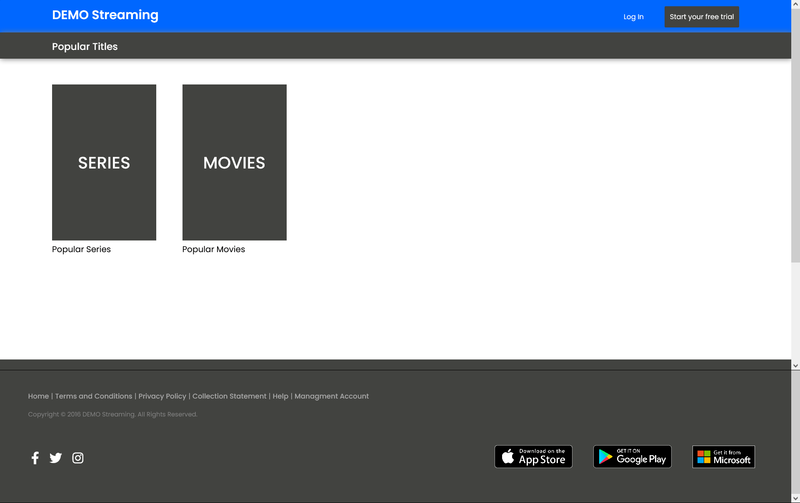
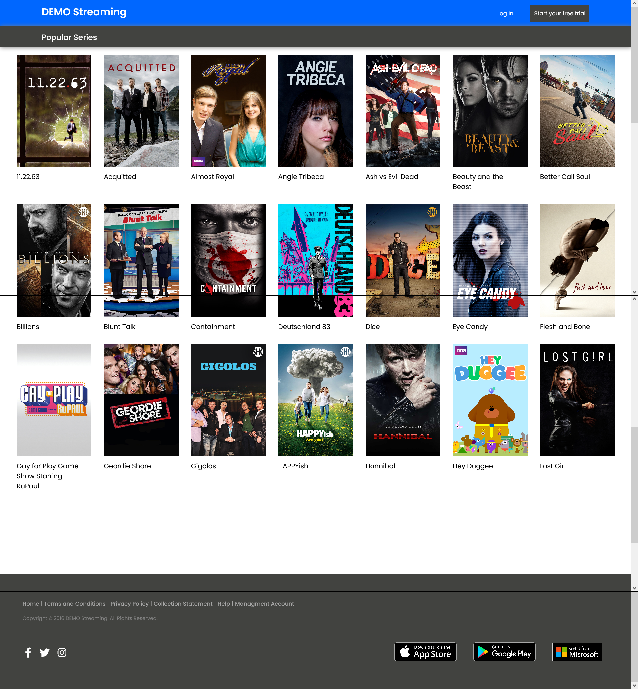

# OTT React Application 🎬

This application designed and developed using the React.js framework. The whole application is divided into three pages i.e. Home, Series, Movie. The data for Series and Movie is fetch using the [API](https://raw.githubusercontent.com/StreamCo/react-coding-challenge/master/feed/sample.json). The application is designed for each device so, it is device friendly application.

## Features

- Every Series and Movie cards are well maintain with the same size for each devices.
- Data for Series and Movie is sorted (i.e. ascending order) based on titles.
- Footer and header of the application is changed according to the device you are using.
- Have a interactive console.

## Questions

**Q1. How did you decide on the technical and architectural choices used as part of your solution?**

A1. The architectural choices is decided on the basis of the information provided in the README document. All the colors combination and the other stuffs like the margin and the padding provided between the components all where decided based upon the README document. And the technical choices where decided based upon the past experience and the application that where designed and summer internship projects helps a lot to figure out the problem at different stages while designing the application.

**Q2. Are there any improvements you could make to your submission?**

A2. Yes, there must be the improved code that can optimize the time taken for showing the relevant result. In the code, I use the `for` loop for iterating the data from an array this can be replace with something more effiecient algorithm.

In designing, other CSS elements can be used which make the CSS file to look simple and more attractive to achieve the same result.

**Q3. What would you do differently if you were allocated more time?**

A3. If, more time allocated then:

- Nav bar for mobile screen can be designed more better.
- Footer can be more attractive for mobile and the tablet screens.
- Good color combination can be achieve.
- More interactive console can be made and more screen can be added like, `login screen`, `signup screen`.

## Screenshots

### Desktop Size

